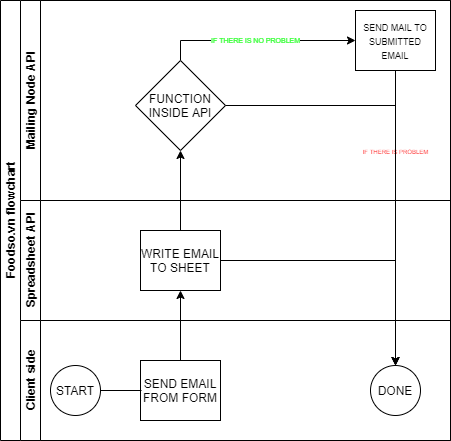

# Coming soon page for Foodso.vn

## The Stack 😆
- Bootstrap 
- HTML/CSS/JS
- Mail Sending using API

## What we have here 🤔
- This is just a coming soon page for foodso.vn which is a food ecommerce using MERN in the near future
- This page is one-page website so there is nothing to expect
- Subscribe form uses a handmade API [here](https://github.com/Summer-Ronin/Foodso-mailing-api), I wrote this piece for foodso.vn only

    

## Where I store my subscribers list 🤔
- It's called [API Spreadsheet](https://www.apispreadsheets.com/)

## How to run in local 🤔
- If you are using VS Code, use Live server or simply just double click on `index.html` in root 